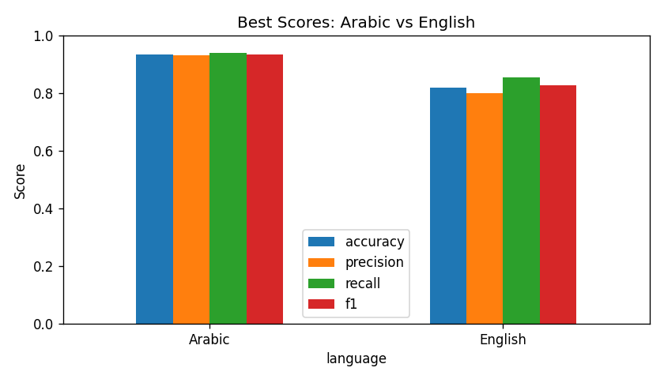
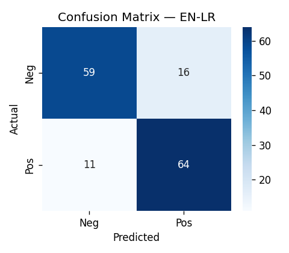
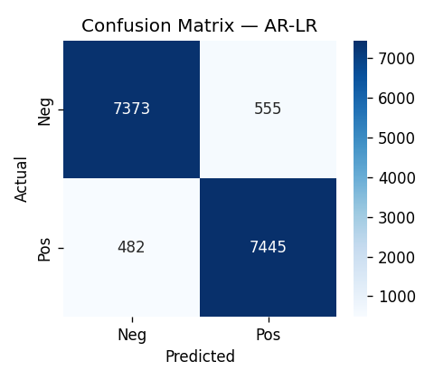

# Multilingual Customer Feedback Analyzer (Arabic + English)

> A single NLP pipeline that reads a customer review in **Arabic or English**, detects the
> language automatically, applies language-specific preprocessing, and predicts whether the
> sentiment is **Positive** or **Negative**.


Most off-the-shelf sentiment tools only understand English, while businesses in bilingual
markets receive feedback in both languages at once. This project handles both with one pipeline,
using classical, fully explainable machine learning (TF-IDF features + linear models) — no GPU
or deep learning required. The whole system lives in one notebook,
`Multilingual_Feedback_Analyzer.ipynb`, and runs in about a minute on CPU.

## What it does

1. Load English and Arabic review datasets.
2. Detect the language of every review (Arabic-script detection).
3. Clean and preprocess each language separately (tokenization, stopword removal, stemming).
4. Train three classical models per language on TF-IDF features: **Logistic Regression**,
   **Naive Bayes**, and **Linear SVM**.
5. Evaluate with accuracy, precision, recall, and F1.
6. Compare Arabic vs. English, extract top TF-IDF keywords, and draw word clouds.
7. Provide a `predict_review()` function to classify any new text by hand.

## Datasets

| Language | Source | File (in `data/raw/`) | Rows | Notes |
|----------|--------|------------------------|------|-------|
| English | [Kaggle — Restaurant Reviews](https://www.kaggle.com/datasets/d4rklucif3r/restaurant-reviews) | `Restaurant_Reviews.tsv` | 1,000 | Included in this repo |
| Arabic  | [HARD — Hotel Arabic Reviews Dataset](https://github.com/elnagara/HARD-Arabic-Dataset) | `balanced-reviews.txt` | ~105,000 | Download separately (large) |

**Labels:** `1 = Positive`, `0 = Negative`. For the Arabic HARD data, star ratings are mapped to
binary (4–5 → Positive, 1–2 → Negative, 3 dropped). The Arabic loader auto-detects encoding
(UTF-16 / UTF-8 / cp1256) and delimiter, so the file works as distributed.

The large Arabic file and the generated `data/processed/` CSVs are **not committed**; download the
HARD dataset and place `balanced-reviews.txt` in `data/raw/`.

## Results

Best model per language (full breakdown in `outputs/results/all_metrics.csv`):

| Language | Best model | Accuracy | F1 |
|----------|-----------|---------:|----:|
| Arabic   | Logistic Regression | 0.935 | 0.935 |
| English  | Logistic Regression | 0.820 | 0.826 |

| Arabic vs. English | English confusion matrix | Arabic confusion matrix |
|---|---|---|
|  |  |  |

> Note: the two datasets differ in domain (restaurants vs. hotels) and size (1k vs. ~105k), so the
> cross-language score gap reflects the data as much as the models — see **Limitations**.

## Installation

```bash
git clone <your-fork-url> multilingual-feedback-analyzer
cd multilingual-feedback-analyzer
python -m venv .venv && source .venv/bin/activate   # Windows: .venv\Scripts\activate
pip install -r requirements.txt
```

The notebook downloads the required NLTK resources (stopwords, tokenizer) on first run.

## Running

1. Ensure `data/raw/Restaurant_Reviews.tsv` is present (it ships with the repo) and add the
   Arabic `balanced-reviews.txt` from HARD.
2. Open `Multilingual_Feedback_Analyzer.ipynb` and **Run All**. Models, figures, and results are
   written to `outputs/`.

### Try the live demo

The notebook trains and saves Logistic Regression models per language; `predict_review()` loads the
matching one:

```python
predict_review("The food was great and service was excellent.")
# -> {'language': 'en', 'sentiment': 'Positive', ...}

predict_review("الفندق سيء جدا والغرفة قذرة")
# -> {'language': 'ar', 'sentiment': 'Negative', ...}
```

## Project structure

```
multilingual-feedback-analyzer/
├── Multilingual_Feedback_Analyzer.ipynb   # full pipeline
├── data/
│   └── raw/Restaurant_Reviews.tsv         # English dataset (Arabic downloaded separately)
├── outputs/
│   ├── figures/    # confusion matrices, comparison chart, word clouds
│   ├── models/     # saved .joblib models and TF-IDF vectorizers
│   └── results/    # metrics CSV, classification reports, keywords, topics, error analysis
├── requirements.txt
├── LICENSE
└── README.md
```

## Limitations

- TF-IDF + linear models **cannot capture context or sarcasm** ("not bad" ≈ "bad").
- The Arabic **ISRI stemmer is aggressive** and can merge unrelated words to one root.
- The English and Arabic datasets are from **different domains and sizes**, so the cross-language
  comparison is not perfectly fair.
- **Binary labels only** — there is no neutral class.

## Future work

- Replace TF-IDF with **multilingual transformer embeddings** (e.g. `xlm-roberta-base`).
- Use **lemmatization** instead of stemming (spaCy for English, Farasa for Arabic).
- Add a **neutral** class for 3-way classification.
- Wrap `predict_review` in a small **Streamlit** web app.

## Acknowledgments

Developed as a university Natural Language Processing course project by **Baraa Alsaker**,
**Fares Aldeeb**, and **Abdulazeez Talat**.

## License

Code released under the [MIT License](LICENSE). Datasets retain their original licenses
(Kaggle Restaurant Reviews; HARD — Hotel Arabic Reviews Dataset).
